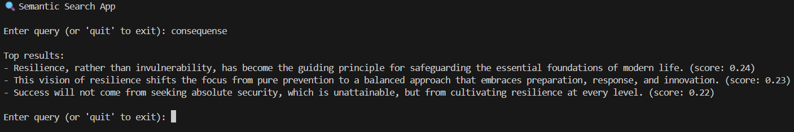

# 🔍 Semantic Search App



A prototype AI-powered search app that finds text based on meaning, not just keywords.  
Built with **Sentence-BERT** and **FAISS**, it turns text into vector embeddings and finds the passages that are semantically closest to your query.  
It’s a prototype showing how modern NLP can make search more accurate, flexible, and human-like. 

---

## 📂 Project Structure

```text
semantic-search-app/
├── data/                 # Text files for searching
│   └── text.md
│
├── src/                   # Source code
│   ├── embedder.py        # Wrapper for Sentence-BERT embeddings
│   ├── search.py          # Semantic search using FAISS
│   └── main.py            # Simple CLI search engine
│
├── requirements.txt       # Python dependencies
└── README.md              # Project description
```

---

## ⚙️ Installation

1. Clone the project:

```bash
git clone https://github.com/<your-repo>/SemanticSearchApp.git
cd SemanticSearchApp
```

2. Set up a virtual environment and install dependencies:

```bash
python -m venv venv
source venv/bin/activate
pip install -r requirements.txt
```

3. Add your text files to the `./data/` folder.
The repo comes with a sample text.md you can replace or extend.

## 🚀 Usage

Run a search from the project root:

```bash
python src/main.py
```

Type a query, and the app will return the passages it finds most semantically relevant.

---

## 🧠 How the AI Works
### 1. Embeddings (Sentence-BERT)
- Both texts and queries are converted into vector representations.
- These embeddings capture meaning rather than just word overlap.

### 2. Vector Index (FAISS)
- All embeddings are stored in a FAISS index for fast similarity search.
- Given a query, FAISS retrieves the nearest neighbors, the most relevant passages.

### 3. Semantic Search
- Results are ranked by semantic closeness, not keywords.
- This makes it possible to find passages that “mean the same thing,” even if they use different words.

## 💡 Why It Matters
- Semantic search is already shaping how we interact with information:
- Customer Support → find the most relevant answers from large FAQ collections.
- Compliance & Legal → quickly navigate regulatory documents.
- Knowledge Management → make internal documentation easier to search.
- This app is a simple prototype, but it demonstrates how AI can improve everyday tasks by focusing on meaning.

## 🛠️ Tech Stack
- Python
- HuggingFace Sentence-BERT
- FAISS for similarity search
- NLTK for text preprocessing

## ✨ Future Improvements
- Add a web interface
- Scale to larger datasets and optimize retrieval performance
- Extend with RAG (Retrieval-Augmented Generation) to combine search and generative AI
- Add evaluation metrics to measure retrieval quality

## 🌍 Language Support
- Uses the multilingual model all-MiniLM-L6-v2, supporting Danish, English, and many other languages.

## 📊 Example

```text
🔍 Semantic Search App

Enter query (or 'quit' to exit): phishing

Top results:
- One of the most common threats is phishing... (score: 0.89)
- Security is not only about technology but also about people... (score: 0.72)
- Cybersecurity is about protecting data... (score: 0.66)
```
